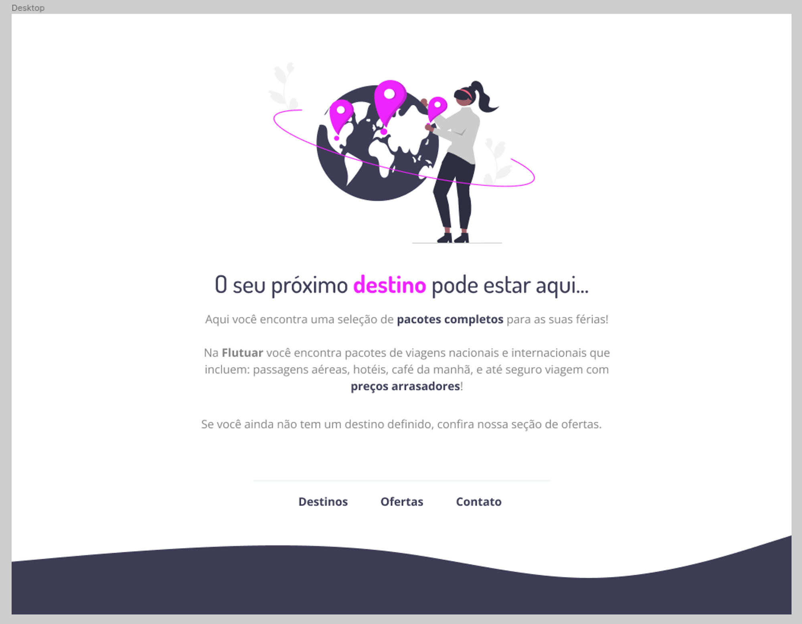

<h1 align="center"> Flutuar </h1>

Repositório do 1º desafio extra da turma 09 do explorer, o objetivo era criar uma página web. 

  <a href="#technologies">Technologies</a>&nbsp;&nbsp;&nbsp;|&nbsp;&nbsp;&nbsp;
  <a href="#project">Project</a>&nbsp;&nbsp;&nbsp;|&nbsp;&nbsp;&nbsp;
  <a href="#layout">Layout</a>

 

  

## 🚀 Technologies

Esse projeto foi desenvolvido com as seguintes tecnologias:

- HTML e CSS
- Git e Github
- Figma

## 💻 Project

O projeto consiste em uma página de divulgação de pacotes de viagem.

- [Visite o projeto online](https://flutuar-raulrodmo.netlify.app/)

## 🔖 Layout

Você pode visualizar o layout do projeto através [DESSE LINK](https://www.figma.com/file/waisYRoNzeBgIxOyrz0b2R/Projeto01-Extra/duplicate). É necessário ter conta no [Figma](https://figma.com) para acessá-lo.

Made with 💜 by raulrodmo

